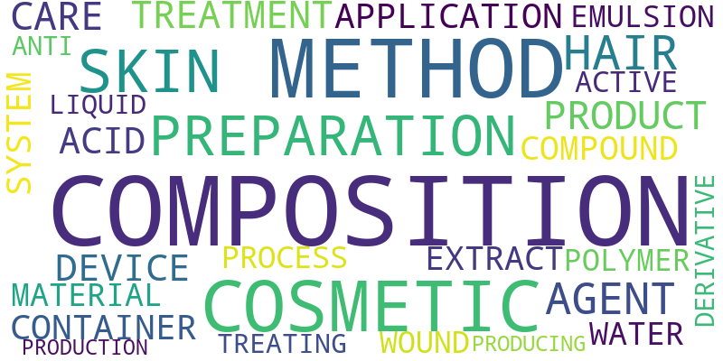
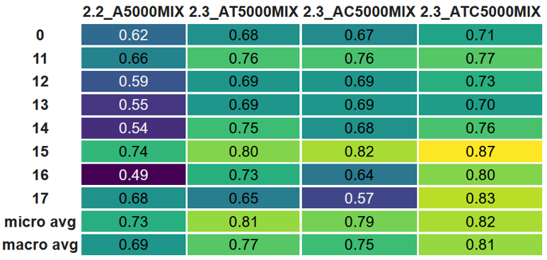

# Multi-Label Classification for Cosmetic Patents Using Neural Networks


<p align="justify">The aim of this thesis is to identify, implement, and evaluate suitable approaches for the classification of patents in the cosmetic domain using neural networks. For this purpose, a patent collection provided by the company Beiersdorf is used as application case. Particular to this patent collection is a company-internal labeling hierarchy that assigns a variable number of labels to each patent in correspondence to the product fields of Beiersdorf. In the course of this thesis, state-of-the-art neural network architectures like convolutional and recurrent neural networks as well as Transformers are applied to the patent data and evaluated regarding their ability to assign the correct labels to unknown patent instances. Properties of the considered data collection, that affect the performance of neural networks, are identified and implications for the prediction accuracy are inferred. A set of solutions is developed that leverages the special characteristics and different features found in a patent document to research the feasibility of automatically recommending labels for unknown patent instances with a high accuracy.</p>

## Structure of the Repository

```
Data
|   Database: Initialization of the database in with a docker yml file
|   Feature and label parsing
|   Description of the data

Experiments
└───Multi Class Classification: One label per instance
       │   GRU Models: Classification based on the Gated Recurrent Unit
       │   CNN Models: Classification based on Convolutional Neural Networks
       │   BERT Models: Classification based on BERT contextual embeddings
└───Multi Label Classification: One or more labels per instance
       |   BERT Models: Classification based on BERT contextual embeddings
       |   BERT Ensemble: Classification based on several concatenated bert layers

Utilities: Some tools to work with the data
```

## Key Results
- Contextual embeddings are more accurate than static embeddings -> BERT outperforms GRU and CNN
- Domain-specific embeddings perform better than generic embeddings
- An appropriate oversampling strategy is fundamental
- Different patent features contain different characteristics that influence the classification
- An ensemble of multiple features is always more accurate than the individual models

The following graphic shows the F1 scores for a subset of the labels as well as the micro and macro average. It can be seen that the ensemble of patent abstract (A), title (T), and first claim (C) outperforms the alternatives. 

